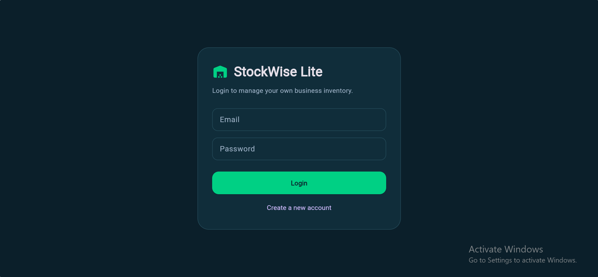
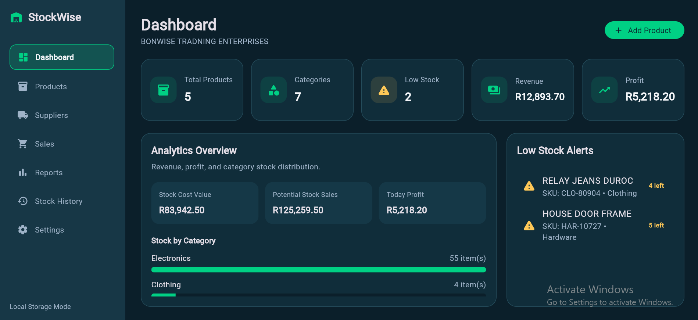
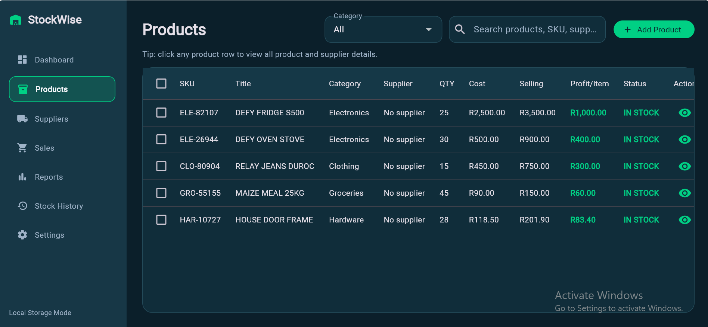
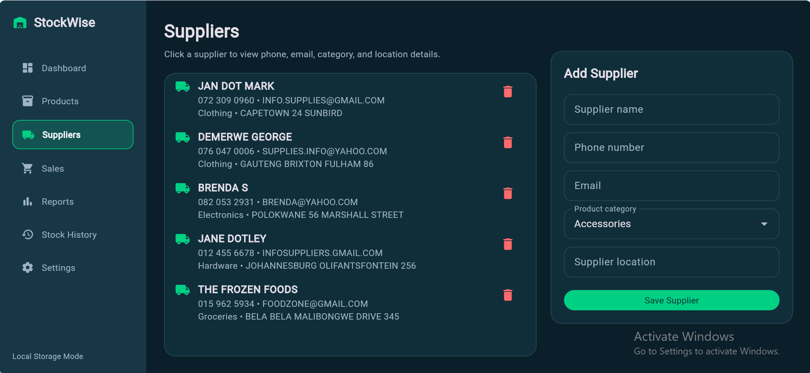
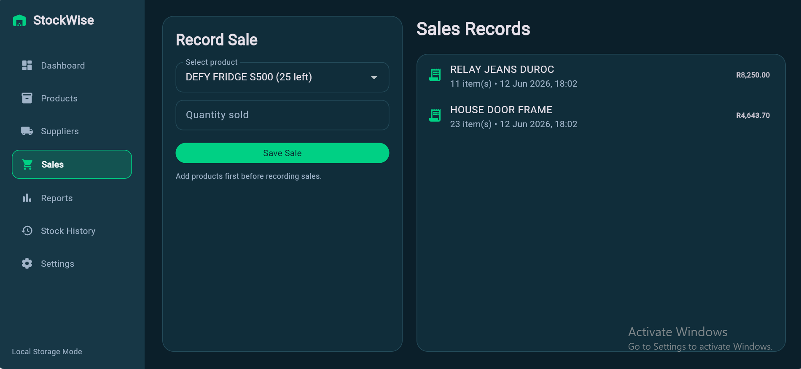
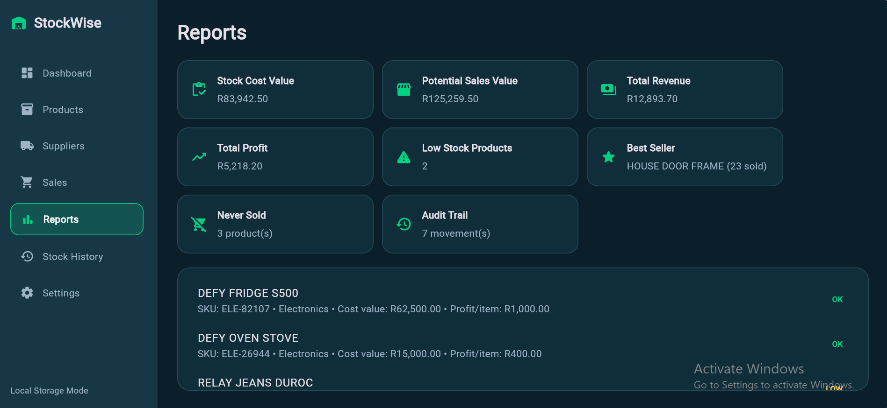
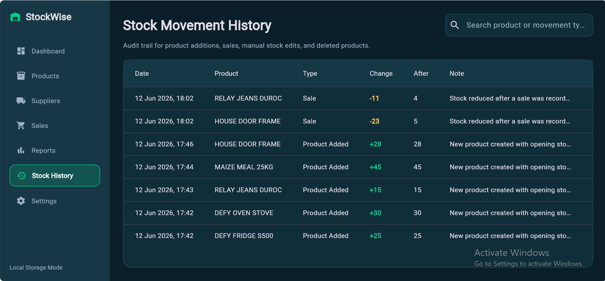

# StockWise Inventory Management System

## Overview

StockWise is a professional inventory management system built with Flutter to help small businesses manage products, suppliers, sales, stock levels, revenue, profit tracking, and business analytics through a modern dashboard.

The system was developed as a portfolio project to demonstrate practical software development skills, business logic implementation, inventory management workflows, reporting, and dashboard analytics.

---

#  Features

## User Authentication

* User registration
* User login
* Secure logout
* Personalized dashboard

## Dashboard

* Total Products
* Total Categories
* Low Stock Alerts
* Total Revenue
* Total Profit
* Stock Analytics Overview
* Category Distribution
* Inventory Summary

## Product Management

* Add Products
* Edit Products
* Delete Products
* Search Products
* Product Detail View
* SKU Generation
* Product Categories
* Cost Price Tracking
* Selling Price Tracking
* Profit Per Item Calculation
* Stock Quantity Management
* Low Stock Monitoring

## Category Management

* Select Existing Categories
* Create New Categories
* Dynamic Category List

## Supplier Management

* Add Suppliers
* Edit Suppliers
* Delete Suppliers
* Supplier Locations
* Contact Information
* Supplier Detail View
* Supplier-to-Product Relationships

## Sales Management

* Record Sales
* Automatic Stock Reduction
* Revenue Tracking
* Profit Tracking
* Sales Receipts

## Reports

* Revenue Reports
* Profit Reports
* Inventory Reports
* Low Stock Reports
* Sales Summary Reports

## Stock History

* Product Additions
* Product Updates
* Product Deletions
* Sales Transactions
* Inventory Movement Tracking

---

#  Project Structure

```text
stockwise_inventory_system/
├── lib/
│   ├── main.dart
│   ├── models/
│   │   ├── product.dart
│   │   ├── supplier.dart
│   │   └── sale.dart
│   ├── screens/
│   │   ├── login_screen.dart
│   │   ├── dashboard_screen.dart
│   │   ├── products_screen.dart
│   │   ├── add_product_screen.dart
│   │   ├── suppliers_screen.dart
│   │   ├── sales_screen.dart
│   │   ├── reports_screen.dart
│   │   └── settings_screen.dart
│   ├── services/
│   │   └── local_database_service.dart
│   ├── widgets/
│   │   ├── sidebar.dart
│   │   ├── dashboard_card.dart
│   │   └── stock_table.dart
│   └── theme/
│       └── app_colors.dart
├── screenshots/
│   ├── login.png
│   ├── dashboard.png
│   ├── products.png
│   ├── suppliers.png
│   ├── sales.png
│   ├── reports.png
│   └── history.png
├── assets/
├── pubspec.yaml
└── README.md
```

---

# Folder Structure Explanation

### Models

Contains all business entities used throughout the application.

* Product
* Supplier
* Sale

### Screens

Contains all user interface pages.

* Login Screen
* Dashboard Screen
* Products Screen
* Add Product Screen
* Suppliers Screen
* Sales Screen
* Reports Screen
* Settings Screen

### Services

Contains data management and local storage functionality.

### Widgets

Contains reusable UI components such as:

* Sidebar Navigation
* Dashboard Cards
* Stock Tables

### Theme

Contains application colours and styling configuration to maintain a consistent user interface throughout the system.

---

#  Technologies Used

## Frontend

* Flutter
* Dart

## Storage

* Local Storage

## Design

* Material Design
* Responsive Dashboard Layout
* Custom UI Components

---

#  Installation

## Clone Repository

## Open Project

```bash
cd stockwise_inventory_system
```

## Install Dependencies

```bash
flutter pub get
```

## Run Application

```bash
flutter run
```

---

# Business Workflow

### Step 1

Create an account and log in.

### Step 2

Add suppliers.

### Step 3

Create categories or use existing categories.

### Step 4

Add products and assign suppliers.

### Step 5

Record sales.

### Step 6

Monitor revenue, profit, and inventory performance through the dashboard.

### Step 7

Generate reports and review stock history.

---

#  Skills Demonstrated

This project demonstrates:

* Flutter Development
* Dart Programming
* Object-Oriented Programming
* CRUD Operations
* Inventory Management Systems
* Business Logic Implementation
* Dashboard Development
* Data Analytics
* Reporting Systems
* UI/UX Design
* Problem Solving
* Software Architecture
* Data Management

# GitHub Realeses
 v1.0.0 - StockWise Lite Initial Release

v2.0.0 - StockWise Business Analytics Update

v3.0.0 - StockWise Professional Edition

#  Screenshots

### Login Screen



### Dashboard


### Products


### Suppliers


### Sales


### Reports



### Stock History



---

#  Future Improvements

* Firebase Integration
* Cloud Database Support
* PDF Report Export
* CSV Export
* Barcode Scanning
* Product Images
* Multi-User Roles
* Notifications
* Dark and Light Themes
* Advanced Analytics
* Mobile and Desktop Synchronization

---

#  Author

**Bono Nenguda**

Diploma in Software Development

StockWise was built as a professional portfolio project to demonstrate practical software development skills, business logic implementation, inventory management workflows, and modern dashboard design.

---

#  Project Goal

The goal of StockWise is to provide small businesses with a simple yet powerful inventory management solution while demonstrating professional software development practices and real-world business application design.
